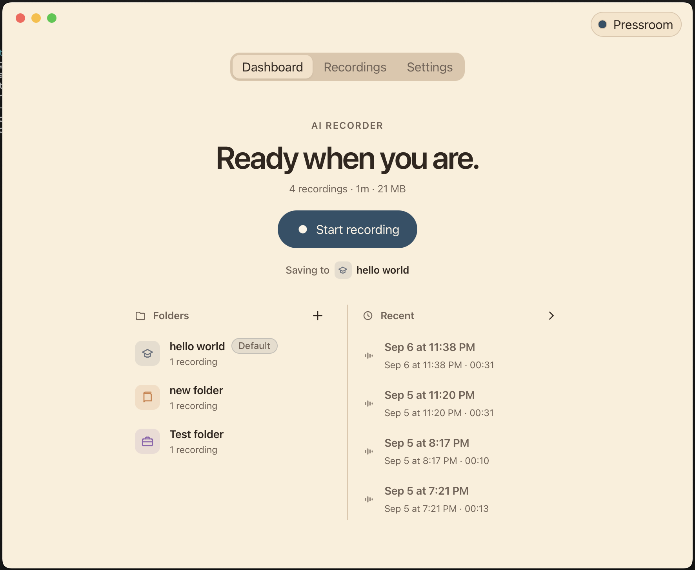
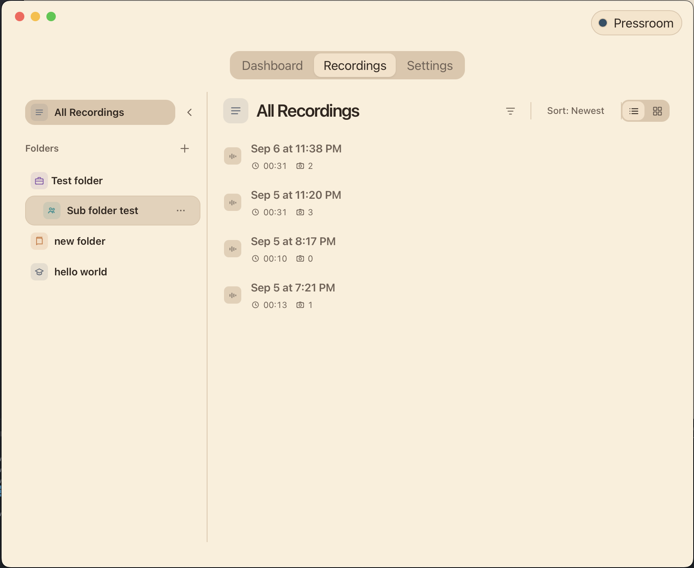
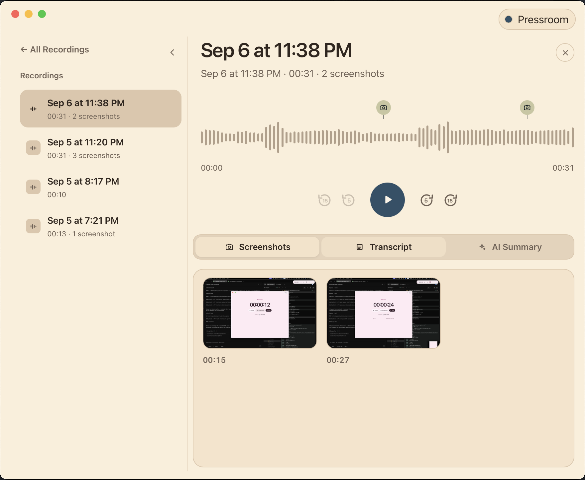
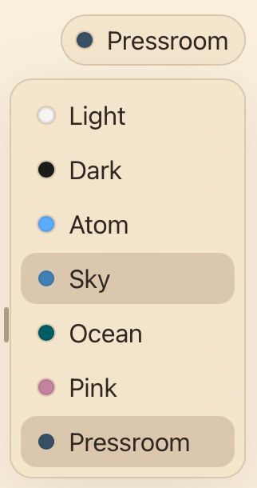

# 🎙️ AI Recorder

Desktop recording assistant for macOS, Windows, and Linux. Capture microphone and computer audio, organize sessions into folders, take screenshots, and transcribe locally or with a cloud provider.

<p align="center">
  
</p>

## ⬇️ Download

You do **not** need to compile the app to use it.

1. Open the [latest GitHub Release](https://github.com/AndrewLenz21/ai-recorder/releases/latest).
2. Download the installer for your system:
   - 🍎 **macOS (Apple Silicon):** `.dmg`
   - 🪟 **Windows:** `.msi` or `.exe` installer
   - 🐧 **Linux:** `.AppImage` or `.deb` when published
3. Install and run **AI Recorder**.

Unsigned macOS builds may show a Gatekeeper warning until Apple notarization is configured. See [RELEASE.md](RELEASE.md).

## 📁 Library and folders

Keep recordings in named folders, switch destinations before you start, and browse everything from the sidebar.

<p align="center">
  
</p>

## ▶️ Playback and transcript

Open a recording to replay audio, jump through screenshots on the timeline, and follow the transcript as it plays. Conversation mode keeps microphone and computer audio on separate tracks.

<p align="center">
  
</p>

## 🎨 Appearance

Switch between Light, Dark, and built-in color themes without leaving the app.

<p align="center">
  
</p>

## 🛠️ Development

Prerequisites: [Node.js](https://nodejs.org/) 24+, [Rust](https://rustup.rs/), and [npm](https://www.npmjs.com/).

```sh
git clone https://github.com/AndrewLenz21/ai-recorder.git
cd ai-recorder
npm install
cd apps/desktop
npm run dev
```

Typecheck the desktop app:

```sh
cd apps/desktop
npm run check-types
```

Production build on your machine:

```sh
cd apps/desktop
npm run tauri build
```

The Tauri app lives in `apps/desktop`. Native capture, permissions, and windows are in `apps/desktop/src-tauri`.

## 📄 License

MIT. See [LICENSE](LICENSE).

---

Built with [OpenCode](https://opencode.ai) using GPT Terra, Luna, and Grok.
